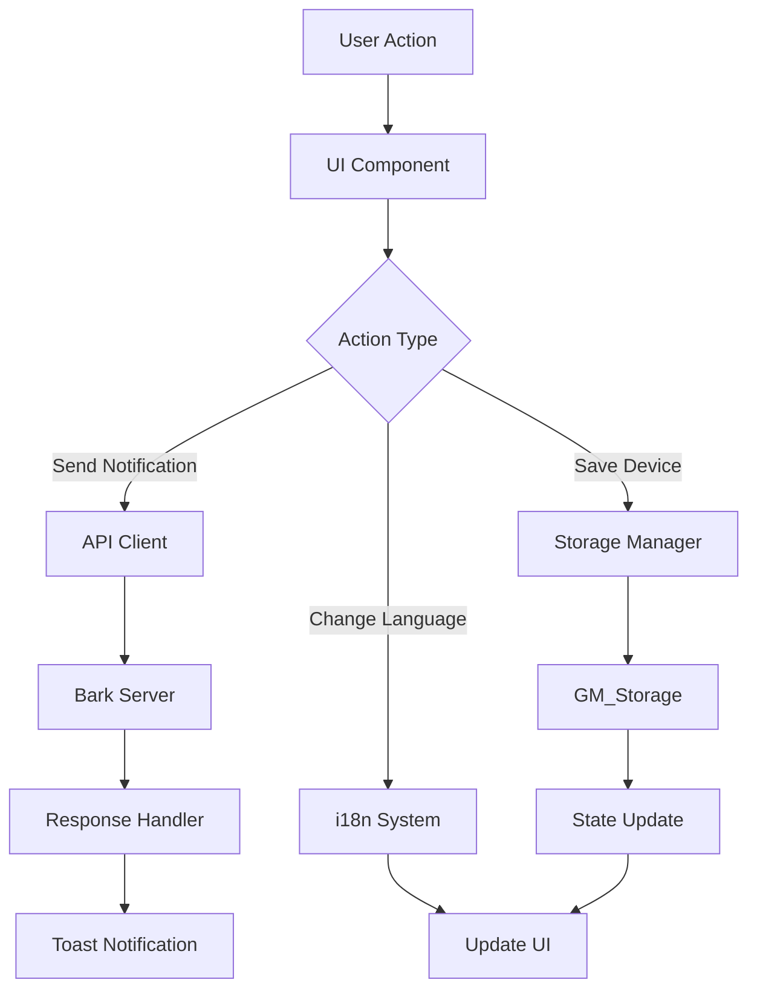

# Design Document: Bark Push Userscript

## Overview

The Bark Push Userscript is a Tampermonkey userscript that provides a universal push notification interface for Bark users. The system consists of three main layers:

1. **UI Layer**: A modal overlay with tabbed interface (Push/Settings)
2. **Storage Layer**: Tampermonkey GM_Storage wrapper for persistent data
3. **API Layer**: Bark API client for sending notifications and testing connections

The design emphasizes simplicity, privacy, and cross-site compatibility. All user data remains local in Tampermonkey storage, and the UI is injected into a shadow DOM to prevent conflicts with host pages.

### Key Design Decisions

- **Shadow DOM**: Isolates styles and prevents conflicts with host pages
- **Vanilla TypeScript**: No UI frameworks to minimize bundle size and complexity
- **Custom i18n**: Lightweight translation system without external dependencies
- **Event-driven architecture**: Decoupled components communicating via custom events
- **Mobile-first responsive**: Works on both desktop and mobile browsers

## Architecture

### Component Hierarchy

```
main.ts (Entry Point)
├── UI Manager
│   ├── Modal Controller
│   │   ├── Push Tab Component
│   │   │   ├── Title Input
│   │   │   ├── Message Textarea
│   │   │   ├── Markdown Toggle
│   │   │   ├── Device Selector
│   │   │   ├── Tips Rotator
│   │   │   ├── Advanced Options Panel
│   │   │   └── Send Button
│   │   └── Settings Tab Component
│   │       ├── Device List View
│   │       │   ├── Device Card (repeating)
│   │       │   └── Add Device Button
│   │       ├── Device Form View
│   │       │   ├── Form Fields
│   │       │   ├── Test Connection Button
│   │       │   └── Save Button
│   │       └── Language Selector
│   └── Toast Notification System
├── Storage Manager
│   ├── Device Storage
│   ├── Preferences Storage
│   └── State Storage
├── API Client
│   ├── Push Notification Handler
│   ├── Connection Tester
│   └── Request Builder
└── i18n System
    ├── Locale Detector
    ├── Translation Loader
    └── t() Function
```

### Data Flow



## Components and Interfaces

### 1. Main Entry Point

**File**: `src/main.ts`

**Responsibilities**:
- Register Tampermonkey menu item
- Initialize i18n system
- Create and inject modal on demand
- Set up global event listeners

**Interface**:
```typescript
// Tampermonkey API
GM_registerMenuCommand(caption: string, callback: () => void): void
GM_setValue(key: string, value: any): void
GM_getValue(key: string, defaultValue?: any): any
GM_xmlhttpRequest(details: RequestDetails): void

// Main initialization
function init(): void
function showModal(): void
function hideModal(): void
```

### 2. Modal Controller

**File**: `src/ui/modal.ts`

**Responsibilities**:
- Create modal DOM structure
- Manage tab switching
- Handle modal open/close
- Inject into shadow DOM

**Interface**:
```typescript
class ModalController {
  private shadowRoot: ShadowRoot;
  private modalElement: HTMLElement;
  private currentTab: 'push' | 'settings';
  
  constructor();
  open(): void;
  close(): void;
  switchTab(tab: 'push' | 'settings'): void;
  render(): void;
  attachEventListeners(): void;
}
```

**Shadow DOM Structure**:
```html
<div id="bark-modal-container">
  <style>/* Scoped styles */</style>
  <div class="backdrop">
    <div class="modal">
      <div class="modal-header">
        <div class="tabs">
          <button class="tab active">Push</button>
          <button class="tab">Settings</button>
        </div>
        <button class="close-btn">✕</button>
      </div>
      <div class="modal-body">
        <!-- Tab content rendered here -->
      </div>
    </div>
  </div>
</div>
```

### 3. Push Tab Component

**File**: `src/ui/components/push-tab.ts`

**Responsibilities**:
- Render push notification form
- Handle form validation
- Manage device selection state
- Rotate tips
- Send notifications

**Interface**:
```typescript
class PushTab {
  private devices: BarkDevice[];
  private selectedDeviceIds: string[];
  private markdownEnabled: boolean;
  private advancedExpanded: boolean;
  
  render(): HTMLElement;
  handleSend(): Promise<void>;
  validateForm(): ValidationResult;
  updateDeviceSelector(): void;
  startTipsRotation(): void;
  stopTipsRotation(): void;
}

interface PushFormData {
  title?: string;
  message: string;
  deviceIds: string[];
  markdownEnabled: boolean;
  sound?: string;
  icon?: string;
  group?: string;
  url?: string;
  autoCopy?: boolean;
  isArchive?: boolean;
}
```

### 4. Settings Tab Component

**File**: `src/ui/components/settings-tab.ts`

**Responsibilities**:
- Render device list or device form
- Handle device CRUD operations
- Manage default device
- Handle language selection

**Interface**:
```typescript
class SettingsTab {
  private devices: BarkDevice[];
  private currentView: 'list' | 'form';
  private editingDeviceId?: string;
  
  render(): HTMLElement;
  renderDeviceList(): HTMLElement;
  renderDeviceForm(deviceId?: string): HTMLElement;
  handleAddDevice(): void;
  handleEditDevice(deviceId: string): void;
  handleDeleteDevice(deviceId: string): void;
  handleSetDefault(deviceId: string): void;
  handleTestConnection(formData: DeviceFormData): Promise<void>;
  handleSaveDevice(formData: DeviceFormData): void;
}

interface DeviceFormData {
  id?: string;
  name?: string;
  serverUrl: string;
  deviceKey: string;
  customHeaders?: string;
}
```

### 5. Device Selector Component

**File**: `src/ui/components/device-selector.ts`

**Responsibilities**:
- Render multi-select dropdown
- Manage selection state
- Display selection count

**Interface**:
```typescript
class DeviceSelector {
  private devices: BarkDevice[];
  private selectedIds: string[];
  private isOpen: boolean;
  
  render(): HTMLElement;
  toggle(): void;
  selectDevice(deviceId: string): void;
  deselectDevice(deviceId: string): void;
  getSelectedDevices(): BarkDevice[];
  updateDisplay(): void;
}
```

### 6. Storage Manager

**File**: `src/storage/storage-manager.ts`

**Responsibilities**:
- Wrap GM_setValue/GM_getValue
- Provide type-safe storage operations
- Handle storage errors

**Interface**:
```typescript
class StorageManager {
  // Device operations
  getDevices(): BarkDevice[];
  saveDevice(device: BarkDevice): void;
  updateDevice(deviceId: string, updates: Partial<BarkDevice>): void;
  deleteDevice(deviceId: string): void;
  getDefaultDeviceId(): string | null;
  setDefaultDeviceId(deviceId: string): void;
  
  // Preferences
  getLanguage(): string;
  setLanguage(locale: string): void;
  getSelectedDeviceIds(): string[];
  setSelectedDeviceIds(ids: string[]): void;
  getMarkdownEnabled(): boolean;
  setMarkdownEnabled(enabled: boolean): void;
  getAdvancedExpanded(): boolean;
  setAdvancedExpanded(expanded: boolean): void;
  getLastTab(): 'push' | 'settings';
  setLastTab(tab: 'push' | 'settings'): void;
}

// Storage keys
const STORAGE_KEYS = {
  DEVICES: 'bark_devices',
  DEFAULT_DEVICE_ID: 'bark_default_device_id',
  LANGUAGE: 'bark_language',
  SELECTED_DEVICE_IDS: 'bark_selected_device_ids',
  MARKDOWN_ENABLED: 'bark_markdown_enabled',
  ADVANCED_EXPANDED: 'bark_advanced_expanded',
  LAST_TAB: 'bark_last_tab',
} as const;
```

### 7. Bark API Client

**File**: `src/api/bark-client.ts`

**Responsibilities**:
- Send push notifications
- Test server connections
- Build API requests
- Handle responses and errors

**Interface**:
```typescript
class BarkClient {
  async sendNotification(
    devices: BarkDevice[],
    payload: NotificationPayload
  ): Promise<void>;
  
  async testConnection(
    serverUrl: string,
    deviceKey: string,
    customHeaders?: string
  ): Promise<boolean>;
  
  private buildRequest(
    device: BarkDevice,
    payload: NotificationPayload
  ): RequestDetails;
  
  private parseCustomHeaders(headers: string): Record<string, string>;
}

interface NotificationPayload {
  title?: string;
  body?: string;
  markdown?: string;
  sound?: string;
  icon?: string;
  group?: string;
  url?: string;
  autoCopy?: boolean;
  automaticallyCopy?: boolean;
  isArchive?: string;
  // ... other Bark API parameters
}

interface BarkApiRequest {
  device_key?: string;
  device_keys?: string[];
  title?: string;
  body?: string;
  markdown?: string;
  sound?: string;
  icon?: string;
  group?: string;
  url?: string;
  // ... other parameters
}
```

**API Request Logic**:
- Single device: Use `device_key` parameter
- Multiple devices: Use `device_keys` array, omit `device_key`
- Markdown mode: Use `markdown` parameter, omit `body`
- Normal mode: Use `body` parameter
- Custom headers: Parse and include in request headers

### 8. i18n System

**File**: `src/i18n/index.ts`

**Responsibilities**:
- Detect browser language
- Load translation files
- Provide t() function for translations
- Handle locale switching

**Interface**:
```typescript
class I18n {
  private currentLocale: string;
  private translations: Record<string, any>;
  
  init(): void;
  detectLocale(): string;
  loadTranslations(locale: string): void;
  t(key: string): string;
  setLocale(locale: string): void;
  getSupportedLocales(): LocaleInfo[];
}

interface LocaleInfo {
  code: string;
  name: string;
  nativeName: string;
}

// Translation key format: 'section.key'
// Example: t('push.title') -> 'Title'
```

**Translation Files**: `src/i18n/locales/`
- `en.ts` - English (default)
- `zh-CN.ts` - Simplified Chinese
- `zh-TW.ts` - Traditional Chinese
- `ja.ts` - Japanese
- `ko.ts` - Korean

### 9. Toast Notification System

**File**: `src/ui/components/toast.ts`

**Responsibilities**:
- Display temporary success/error messages
- Auto-dismiss after timeout
- Support multiple toasts

**Interface**:
```typescript
class ToastManager {
  show(message: string, type: 'success' | 'error' | 'info', duration?: number): void;
  hide(toastId: string): void;
  clear(): void;
}

// Usage
toast.show(t('push.success'), 'success', 2000);
toast.show(t('errors.networkError'), 'error', 5000);
```

### 10. Validation Utilities

**File**: `src/utils/validation.ts`

**Responsibilities**:
- Validate URLs
- Validate device keys
- Validate custom headers
- Validate form inputs

**Interface**:
```typescript
interface ValidationResult {
  valid: boolean;
  errors: Record<string, string>;
}

function validateUrl(url: string): boolean;
function validateDeviceKey(key: string): boolean;
function validateCustomHeaders(headers: string): boolean;
function validatePushForm(data: PushFormData): ValidationResult;
function validateDeviceForm(data: DeviceFormData): ValidationResult;
```

## Data Models

### BarkDevice

```typescript
interface BarkDevice {
  id: string;              // UUID v4
  name?: string;           // Optional friendly name
  serverUrl: string;       // e.g., "https://api.day.app"
  deviceKey: string;       // 22-character key from Bark app
  customHeaders?: string;  // Newline-separated headers
  isDefault: boolean;      // Whether this is the default device
  createdAt: string;       // ISO 8601 timestamp
}
```

### Storage Schema

```typescript
// GM_Storage structure
{
  "bark_devices": BarkDevice[],
  "bark_default_device_id": string | null,
  "bark_language": string,
  "bark_selected_device_ids": string[],
  "bark_markdown_enabled": boolean,
  "bark_advanced_expanded": boolean,
  "bark_last_tab": "push" | "settings"
}
```

### Bark API Request/Response

**Request** (POST /push):
```typescript
{
  "device_key"?: string,        // Single device
  "device_keys"?: string[],     // Multiple devices
  "title"?: string,
  "body"?: string,              // Used when markdown disabled
  "markdown"?: string,          // Used when markdown enabled
  "sound"?: string,
  "icon"?: string,
  "group"?: string,
  "url"?: string,
  "badge"?: number,
  "level"?: "critical" | "active" | "timeSensitive" | "passive",
  "volume"?: number,
  "call"?: string,
  "isArchive"?: string,
  "autoCopy"?: string,
  "copy"?: string,
  "automaticallyCopy"?: boolean,
  "action"?: string,
  "image"?: string,
  "id"?: string,
  "delete"?: string
}
```

**Response** (Success):
```typescript
{
  "code": 200,
  "message": "success",
  "timestamp": 1234567890
}
```

**Response** (Error):
```typescript
{
  "code": 400,
  "message": "error description",
  "timestamp": 1234567890
}
```

## Correctness Properties

*A property is a characteristic or behavior that should hold true across all valid executions of a system—essentially, a formal statement about what the system should do. Properties serve as the bridge between human-readable specifications and machine-verifiable correctness guarantees.*


### Property Reflection

After analyzing all acceptance criteria, I've identified the following redundancies and consolidations:

**Redundant Properties:**
- 1.3 and 23.1 (viewport > 470px → 450px width) - Same property, consolidate
- 1.4 and 23.2 (viewport ≤ 470px → responsive width) - Same property, consolidate
- 5.2 and 10.6 (markdown off → body parameter) - Same property, consolidate
- 5.3 and 10.5 (markdown on → markdown parameter) - Same property, consolidate
- 6.5 and 15.3 (auto-select default device) - Same property, consolidate
- 12.11 and 16.2 (validation error display) - Same property, consolidate
- 10.8 and 22.4 (display server error message) - Same property, consolidate
- 2.2 and 21.1 (ESC closes modal) - Same example, keep one
- 4.6, 9.9, and 21.2 (Ctrl+Enter sends) - Same example, keep one

**Properties to Combine:**
- 18.1-18.6 (storage of various values) - Combine into one storage round-trip property
- 19.1-19.8 (device data model properties) - Combine into one device structure property
- 24.2, 24.3, 24.5, 24.7 (visual consistency) - Combine into one visual standards property

**Properties Providing Unique Value:**
After consolidation, we have approximately 60 unique testable properties covering:
- UI interaction and state management
- API request building and error handling
- Data persistence and validation
- Responsive design and accessibility
- Device management workflows

### Correctness Properties

Property 1: Modal responsive width
*For any* viewport width, the modal width should be 450px when viewport > 470px, or calc(100vw - 20px) with max-width 450px when viewport ≤ 470px
**Validates: Requirements 1.3, 1.4, 23.1, 23.2**

Property 2: Modal styling consistency
*For any* modal instance, it should have white background, 8px border-radius, drop shadow, and z-index above page content
**Validates: Requirements 1.5, 1.6**

Property 3: Tab state persistence
*For any* tab selection, closing and reopening the modal should restore the previously active tab
**Validates: Requirements 3.5**

Property 4: Active tab visual indication
*For any* active tab, it should have the "active" CSS class applied
**Validates: Requirements 3.4**

Property 5: Title field single-line constraint
*For any* text input in the title field, newline characters should be prevented or stripped
**Validates: Requirements 4.3**

Property 6: Message field multi-line support
*For any* text input in the message field, newline characters should be preserved
**Validates: Requirements 4.4**

Property 7: Markdown mode affects body parameter
*For any* notification with markdown disabled, the API request should include the `body` parameter with message content
**Validates: Requirements 5.2, 10.6**

Property 8: Markdown mode affects markdown parameter
*For any* notification with markdown enabled, the API request should include the `markdown` parameter and omit the `body` parameter
**Validates: Requirements 5.3, 10.5**

Property 9: Markdown toggle persistence
*For any* markdown toggle state, it should be saved to storage and restored on next modal open
**Validates: Requirements 5.4**

Property 10: Device selector shows all devices
*For any* list of configured devices, the device selector dropdown should display exactly that many checkboxes
**Validates: Requirements 6.2**

Property 11: Device selection count display
*For any* number of selected devices N, the dropdown should display "N device(s) selected"
**Validates: Requirements 6.4**

Property 12: Default device auto-selection
*For any* modal open when a default device is configured, that device should be automatically selected in the device selector
**Validates: Requirements 6.5, 15.3**

Property 13: Multi-device uses device_keys array
*For any* notification sent to multiple devices, the API request should include `device_keys` array and omit `device_key`
**Validates: Requirements 6.6**

Property 14: Single device uses device_key
*For any* notification sent to a single device, the API request should include `device_key` parameter
**Validates: Requirements 10.3**

Property 15: Device selection persistence
*For any* device selection, it should be saved to storage and restored on next modal open
**Validates: Requirements 6.7**

Property 16: Tips rotation timing
*For any* tips display when devices are configured, the tip should change after 5 seconds
**Validates: Requirements 7.3**

Property 17: Tips cycle continuously
*For any* tips rotation, after displaying the last tip, it should return to the first tip
**Validates: Requirements 7.5**

Property 18: Advanced options visibility
*For any* advanced options section state, when collapsed all advanced fields should be hidden, when expanded all should be visible
**Validates: Requirements 8.2**

Property 19: Advanced options state persistence
*For any* advanced options expanded/collapsed state, it should be saved to storage and restored on next modal open
**Validates: Requirements 8.6**

Property 20: Optional parameters inclusion
*For any* optional parameter with a non-empty value, it should be included in the API request
**Validates: Requirements 8.5**

Property 21: Send button disabled when no devices
*For any* UI state with zero configured devices, the send button should be disabled
**Validates: Requirements 9.2**

Property 22: Send button disabled when none selected
*For any* UI state with devices configured but none selected, the send button should be disabled
**Validates: Requirements 9.3**

Property 23: Send button disabled when message empty
*For any* UI state with empty message field, the send button should be disabled
**Validates: Requirements 9.4**

Property 24: Form reset after successful send
*For any* successful notification send, the title and message fields should be cleared while device selection remains unchanged
**Validates: Requirements 9.8**

Property 25: API endpoint correctness
*For any* notification request, it should be sent as POST to `{serverUrl}/push`
**Validates: Requirements 10.1**

Property 26: Content-Type header inclusion
*For any* notification request, it should include `Content-Type: application/json; charset=utf-8` header
**Validates: Requirements 10.2**

Property 27: Custom headers inclusion
*For any* device with custom headers configured, requests to that device should include those headers
**Validates: Requirements 10.7**

Property 28: Server error message display
*For any* API error response, the system should parse and display the error message to the user
**Validates: Requirements 10.8, 22.4**

Property 29: Device list display completeness
*For any* device in storage, the device list should display a card with name, server URL, and truncated device key
**Validates: Requirements 11.3**

Property 30: Default device visual indicator
*For any* device with isDefault=true, its card should display a ⭐ star icon
**Validates: Requirements 11.4**

Property 31: Custom headers visual indicator
*For any* device with non-empty customHeaders, its card should display a 🔒 lock icon
**Validates: Requirements 11.5**

Property 32: Device list ordering
*For any* list of devices, they should be ordered by createdAt timestamp in ascending order
**Validates: Requirements 11.6**

Property 33: Device action buttons presence
*For any* device card, it should display [Set Default] [Edit] [Delete] buttons
**Validates: Requirements 11.7**

Property 34: URL validation
*For any* invalid URL string, validation should fail with appropriate error message
**Validates: Requirements 12.5**

Property 35: Device key required validation
*For any* empty device key, validation should fail
**Validates: Requirements 12.6**

Property 36: Device save operation
*For any* valid device form data, clicking Save should persist the device to GM_Storage
**Validates: Requirements 12.10**

Property 37: Validation error display
*For any* invalid form field, an error message should be displayed near that field
**Validates: Requirements 12.11, 16.2, 22.6**

Property 38: Edit form pre-population
*For any* device being edited, the form should be pre-filled with that device's current values
**Validates: Requirements 13.1**

Property 39: Device update operation
*For any* modified device form data, clicking Save should update the device in GM_Storage
**Validates: Requirements 13.2**

Property 40: Edit preserves immutable fields
*For any* device edit operation, the createdAt timestamp should remain unchanged
**Validates: Requirements 13.4**

Property 41: Device deletion operation
*For any* device, confirming deletion should remove it from GM_Storage
**Validates: Requirements 14.2**

Property 42: Default device cleared on deletion
*For any* device deletion where that device was the default, the default device ID should be cleared
**Validates: Requirements 14.3**

Property 43: Set default operation
*For any* device, clicking Set Default should set its isDefault to true
**Validates: Requirements 15.1**

Property 44: Single default device constraint
*For any* device list, at most one device should have isDefault=true
**Validates: Requirements 15.2**

Property 45: Default device ID persistence
*For any* default device change, the default device ID should be saved to GM_Storage
**Validates: Requirements 15.4**

Property 46: Language matching
*For any* supported browser language, the system should use that language for the UI
**Validates: Requirements 17.3**

Property 47: Language change updates UI
*For any* language selection change, all UI text should update immediately to the new language
**Validates: Requirements 17.6**

Property 48: Language preference persistence
*For any* language selection, it should be saved to storage and used on subsequent loads (round-trip)
**Validates: Requirements 17.7, 17.8**

Property 49: Storage round-trip consistency
*For any* user preference (language, selected devices, markdown state, advanced state, last tab), saving then loading should return the same value
**Validates: Requirements 18.1, 18.2, 18.3, 18.4, 18.5, 18.6**

Property 50: No external data transmission
*For any* network request made by the system, it should only be to configured Bark server URLs
**Validates: Requirements 18.8**

Property 51: Device data structure completeness
*For any* device saved to storage, it should have all required properties: id, name, serverUrl, deviceKey, customHeaders, isDefault, createdAt
**Validates: Requirements 19.1**

Property 52: Device ID uniqueness
*For any* two devices, their id values should be different
**Validates: Requirements 19.2**

Property 53: Device data type validation
*For any* device, name and customHeaders should be strings or undefined, serverUrl and deviceKey should be non-empty strings, isDefault should be boolean, createdAt should be ISO 8601 string
**Validates: Requirements 19.3, 19.4, 19.5, 19.6, 19.7, 19.8**

Property 54: Host page DOM isolation
*For any* modal operation, the host page's DOM should remain unchanged except for the modal container element
**Validates: Requirements 20.4**

Property 55: Modal cleanup on close
*For any* modal close operation, all modal elements should be removed from the DOM
**Validates: Requirements 20.5**

Property 56: Tab navigation order
*For any* focusable element in the modal, pressing Tab should move focus to the next element in logical order
**Validates: Requirements 21.4**

Property 57: Focus indicator visibility
*For any* focusable element when focused, it should have visible focus styles applied
**Validates: Requirements 21.5**

Property 58: Required field error message
*For any* required field that is empty, validation should display "This field is required"
**Validates: Requirements 22.1**

Property 59: Invalid URL error message
*For any* invalid URL, validation should display "Invalid URL format. Use http:// or https://"
**Validates: Requirements 22.2**

Property 60: Invalid headers error message
*For any* malformed custom headers, validation should display "Invalid header format. Use 'Name: Value' format, one per line."
**Validates: Requirements 22.5**

Property 61: Error clearing on correction
*For any* field with a validation error, correcting the input should clear the error message
**Validates: Requirements 22.7**

Property 62: Modal maximum height
*For any* modal content, the modal should have max-height of 600px with scrollable overflow
**Validates: Requirements 23.3**

Property 63: Touch-friendly button sizing
*For any* button element, it should have minimum dimensions of 44x44px
**Validates: Requirements 23.4**

Property 64: Minimum font size
*For any* body text element, the font-size should be at least 14px
**Validates: Requirements 24.3**

Property 65: Color contrast compliance
*For any* text element, the color contrast ratio should meet WCAG AA standards (4.5:1 for normal text, 3:1 for large text)
**Validates: Requirements 24.4**

Property 66: Transition timing consistency
*For any* interactive element with transitions, the transition duration should be 200ms
**Validates: Requirements 24.5**

Property 67: Loading spinner display
*For any* async operation (send, test connection), a loading spinner should be displayed during execution
**Validates: Requirements 24.6**

Property 68: Modal appearance performance
*For any* menu item click, the modal should appear within 100ms
**Validates: Requirements 25.1**

Property 69: Device list rendering performance
*For any* device list with up to 20 devices, rendering should complete within 50ms
**Validates: Requirements 25.2**

## Error Handling

### Error Categories

1. **Validation Errors**
   - Empty required fields
   - Invalid URL format
   - Malformed custom headers
   - Display inline near the field
   - Clear when user corrects input

2. **Network Errors**
   - Connection timeout (10 seconds)
   - DNS resolution failure
   - Server unreachable
   - Display user-friendly message: "Network error. Please check your connection."

3. **API Errors**
   - 4xx client errors (invalid request)
   - 5xx server errors
   - Parse error message from response
   - Display server's error message to user

4. **Storage Errors**
   - GM_Storage unavailable
   - Storage quota exceeded
   - Display error message and disable functionality

5. **Runtime Errors**
   - JavaScript exceptions
   - Log to console
   - Display generic error message to user
   - Don't crash the modal

### Error Handling Strategy

```typescript
// Validation errors
try {
  const result = validateDeviceForm(formData);
  if (!result.valid) {
    displayFieldErrors(result.errors);
    return;
  }
} catch (error) {
  console.error('Validation error:', error);
  showToast(t('errors.unknownError'), 'error');
}

// Network errors
try {
  const response = await GM_xmlhttpRequest({
    method: 'POST',
    url: `${device.serverUrl}/push`,
    timeout: 10000,
    // ...
  });
} catch (error) {
  if (error.timeout) {
    showToast(t('errors.networkTimeout'), 'error');
  } else if (error.status === 0) {
    showToast(t('errors.networkError'), 'error');
  } else if (error.status >= 400 && error.status < 500) {
    showToast(parseApiError(error.responseText), 'error');
  } else if (error.status >= 500) {
    showToast(t('errors.serverError'), 'error');
  } else {
    showToast(t('errors.unknownError'), 'error');
  }
}

// Storage errors
try {
  GM_setValue('bark_devices', devices);
} catch (error) {
  console.error('Storage error:', error);
  showToast(t('errors.storageError'), 'error');
  disableUI();
}
```

### Error Recovery

- **Validation errors**: User can correct input and retry
- **Network errors**: User can retry the operation
- **API errors**: User can check settings and retry
- **Storage errors**: User must fix Tampermonkey/browser issue
- **Runtime errors**: User can close and reopen modal

## Testing Strategy

### Dual Testing Approach

This project requires both unit tests and property-based tests for comprehensive coverage:

**Unit Tests** focus on:
- Specific UI interactions (button clicks, form submissions)
- Edge cases (empty device list, no default device)
- Error conditions (network failures, invalid inputs)
- Integration points (Tampermonkey API, Bark API)

**Property-Based Tests** focus on:
- Universal properties across all inputs (validation, API request building)
- State persistence (storage round-trips)
- Data structure invariants (device uniqueness, single default)
- UI consistency (responsive design, accessibility)

Together, these approaches provide comprehensive coverage where unit tests catch concrete bugs and property tests verify general correctness.

### Property-Based Testing Configuration

**Library**: Use `fast-check` for TypeScript/JavaScript property-based testing

**Configuration**:
- Minimum 100 iterations per property test
- Each test tagged with: `Feature: bark-push-userscript, Property N: [property text]`
- Each correctness property implemented by a SINGLE property-based test

**Example Property Test**:
```typescript
import fc from 'fast-check';

// Feature: bark-push-userscript, Property 52: Device ID uniqueness
test('Property 52: Device ID uniqueness', () => {
  fc.assert(
    fc.property(
      fc.array(fc.record({
        name: fc.option(fc.string()),
        serverUrl: fc.webUrl(),
        deviceKey: fc.string({ minLength: 1 }),
        customHeaders: fc.option(fc.string()),
      }), { minLength: 2, maxLength: 10 }),
      (deviceInputs) => {
        const devices = deviceInputs.map(input => createDevice(input));
        const ids = devices.map(d => d.id);
        const uniqueIds = new Set(ids);
        return ids.length === uniqueIds.size;
      }
    ),
    { numRuns: 100 }
  );
});
```

### Unit Testing Patterns

**UI Component Tests**:
```typescript
describe('Modal Controller', () => {
  test('opens modal when menu item clicked', () => {
    const modal = new ModalController();
    modal.open();
    expect(document.querySelector('#bark-modal-container')).toBeTruthy();
  });

  test('closes modal on ESC key', () => {
    const modal = new ModalController();
    modal.open();
    fireEvent.keyDown(document, { key: 'Escape' });
    expect(document.querySelector('#bark-modal-container')).toBeFalsy();
  });
});
```

**API Client Tests**:
```typescript
describe('Bark API Client', () => {
  test('sends notification to single device', async () => {
    const client = new BarkClient();
    const device = createTestDevice();
    const payload = { body: 'Test message' };
    
    await client.sendNotification([device], payload);
    
    expect(mockXmlHttpRequest).toHaveBeenCalledWith(
      expect.objectContaining({
        method: 'POST',
        url: `${device.serverUrl}/push`,
        data: expect.stringContaining('"device_key"'),
      })
    );
  });

  test('handles network timeout', async () => {
    const client = new BarkClient();
    mockXmlHttpRequest.mockRejectedValue({ timeout: true });
    
    await expect(
      client.sendNotification([device], payload)
    ).rejects.toThrow('Network timeout');
  });
});
```

**Storage Tests**:
```typescript
describe('Storage Manager', () => {
  test('saves and retrieves devices', () => {
    const storage = new StorageManager();
    const device = createTestDevice();
    
    storage.saveDevice(device);
    const devices = storage.getDevices();
    
    expect(devices).toContainEqual(device);
  });

  test('enforces single default device', () => {
    const storage = new StorageManager();
    const device1 = createTestDevice();
    const device2 = createTestDevice();
    
    storage.saveDevice({ ...device1, isDefault: true });
    storage.saveDevice({ ...device2, isDefault: true });
    
    const devices = storage.getDevices();
    const defaultDevices = devices.filter(d => d.isDefault);
    expect(defaultDevices).toHaveLength(1);
  });
});
```

### Test Coverage Goals

- **Unit test coverage**: 80%+ of code paths
- **Property test coverage**: All 69 correctness properties
- **Integration tests**: Key user workflows (add device, send notification)
- **E2E tests**: Manual testing on multiple websites and browsers

### Testing Tools

- **Test framework**: Jest or Vitest
- **Property testing**: fast-check
- **DOM testing**: @testing-library/dom
- **Mocking**: Built-in Jest/Vitest mocks for GM_* functions
- **Coverage**: Built-in coverage tools

### Continuous Testing

- Run unit tests on every commit
- Run property tests on every PR
- Manual E2E testing before releases
- Test on multiple browsers (Chrome, Firefox, Safari)
- Test on multiple websites (simple HTML, React SPAs, complex sites)
